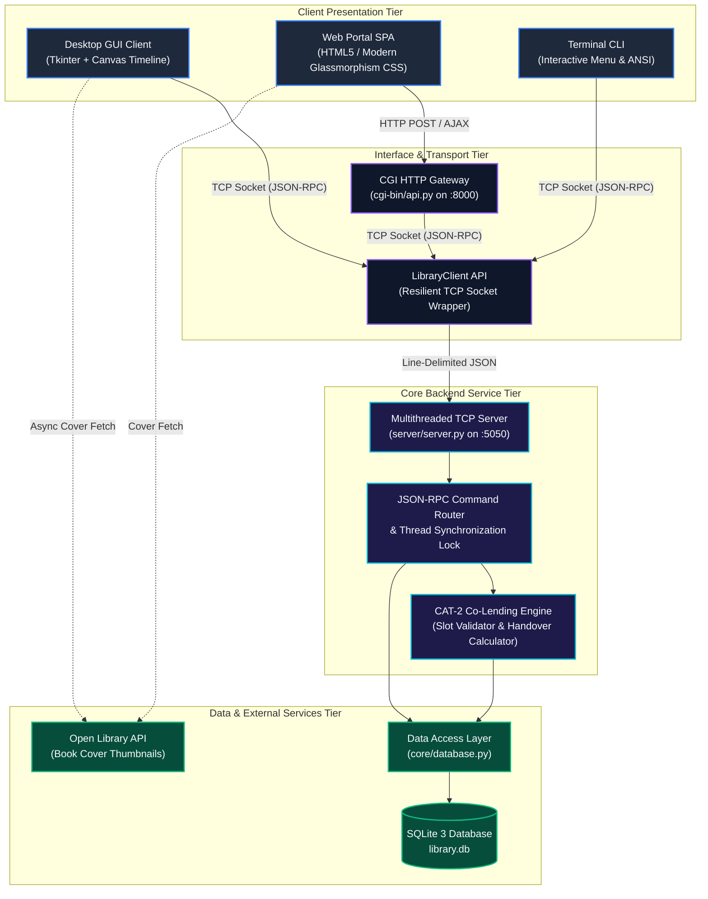
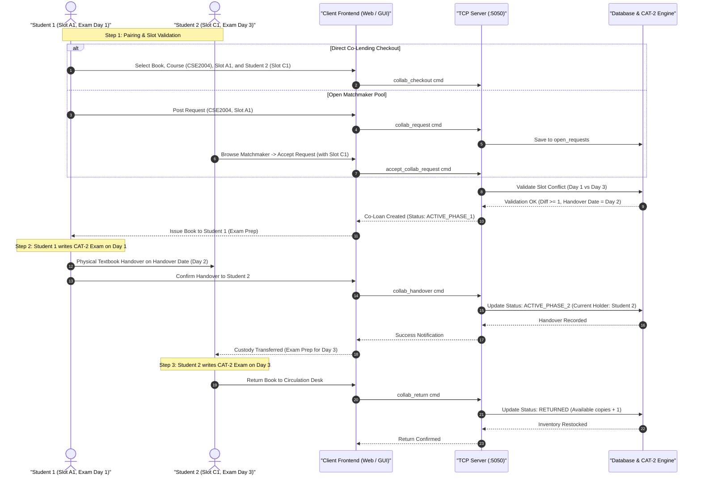
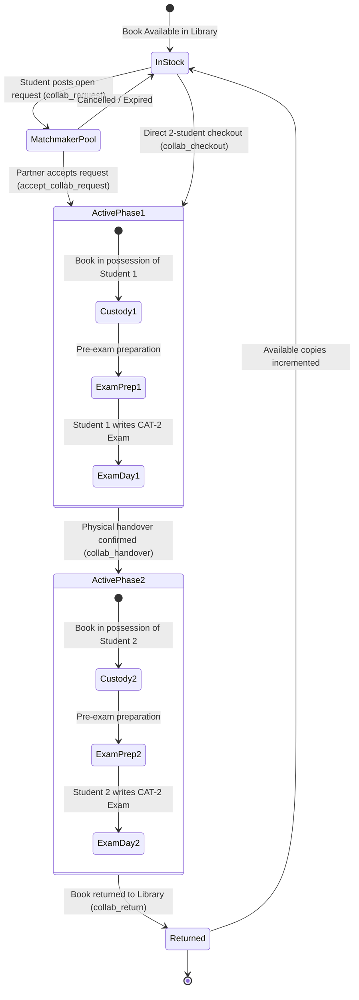
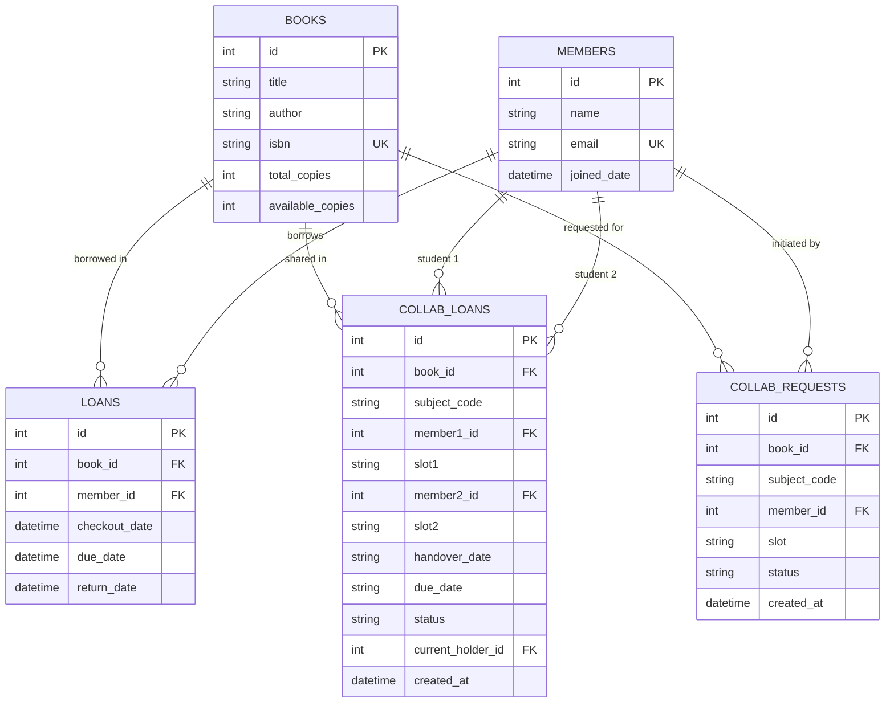

# 📚 Library Management System with CAT-2 Collaborative Lending

[](https://www.python.org/)
[](https://www.sqlite.org/)
[]()
[]()
[]()
[]()
[]()

> A production-grade, multi-tier library management platform featuring a **slot-aware collaborative book lending engine** designed for university Continuous Assessment Tests (CAT-2 open-book examinations). Built strictly with the **Python standard library** and zero third-party framework dependencies.

---

## 📑 Table of Contents

- [Core Innovation: CAT-2 Collaborative Lending](#-core-innovation-cat-2-collaborative-lending)
- [Technology Stack](#-technology-stack)
- [System Architecture](#-system-architecture)
- [Workflows & State Transitions](#-workflows--state-transitions)
- [University Timetable Slot & Compatibility Matrix](#-university-timetable-slot--compatibility-matrix)
- [Key Features](#-key-features)
- [Directory Structure](#-directory-structure)
- [Quick Start Guide](#-quick-start-guide)
- [TCP JSON-RPC Protocol Specification](#-tcp-json-rpc-protocol-specification)
- [Database Schema & Entity Relationship](#-database-schema--entity-relationship)
- [Automated Testing & Quality Assurance](#-automated-testing--quality-assurance)
- [Configuration & Environment Variables](#-configuration--environment-variables)
- [Contributing & License](#-contributing--license)

---

## 💡 Core Innovation: CAT-2 Collaborative Lending

### 🛑 The Problem
During college **CAT-2 Open-Book Examinations**, demand for core technical textbooks (*Python Programming, Object-Oriented C++, Discrete Mathematics, Theory of Computation, and Engineering Economics*) surges exponentially. Standard university libraries maintain limited physical copies (often 2–4 copies per title). Under conventional single-borrower lending (14-day duration), a single student monopolizes a textbook for the entire examination period, leaving dozens of classmates with zero access.

### 🎯 The Solution: Slot-Aware Co-Lending
Universities schedule open-book exams across distinct academic timetable slots (`A1`, `B1`, `C1`, `D1`, `E1`, `F1`, `A2`, `B2`, etc.). Because slot-specific exams take place on **different calendar days**, two students taking the same course in different slots never need the textbook on the same exam day.

```
Example: Python Programming (Course Code: CSE2004)
├── Student 1: Slot A1  --> Exam scheduled on Day 1
└── Student 2: Slot C1  --> Exam scheduled on Day 3
```

Our system validates slot compatibility and automatically splits a single physical book loan into two sequential custody phases:
1. **Phase 1 (Preparation & Exam 1)**: Student 1 holds the book for pre-exam review and writes their exam on **Day 1**.
2. **Scheduled Handover (Milestone)**: On **Day 2**, custody is formally transferred to Student 2.
3. **Phase 2 (Preparation & Exam 2)**: Student 2 uses the book for study and writes their exam on **Day 3**.
4. **Library Restock**: Student 2 returns the book to the circulation desk, ready for regular lending.

---

## 🛠 Technology Stack

The entire system is deliberately architected without bloated external dependencies, maximizing portability, low-latency execution, and runtime stability.

| Layer | Technology | Module / Component | Purpose & Implementation Highlights |
| :--- | :--- | :--- | :--- |
| **Language** | Python 3.10+ | Standard CPython | Type hints, `dataclasses`, `contextlib`, modern Python idioms |
| **Persistence** | SQLite 3 | `sqlite3` | Zero-config ACID transactional storage, foreign key constraints, parameterized SQL queries |
| **Networking** | TCP / Sockets | `socket`, `socketserver` | High-throughput multithreaded TCP backend with line-delimited JSON-RPC framing |
| **Concurrency** | Multi-Threading | `threading`, `Lock` | Mutex-synchronized database access protecting shared inventory state across concurrent clients |
| **Desktop GUI** | Tkinter / Tcl-Tk | `tkinter`, `ttk` | Segoe UI modern dark/light styling, interactive timetable matrix, visual handover progress timeline |
| **Web Portal** | Vanilla Web SPA | HTML5, Vanilla CSS3, JS ES6+ | Glassmorphism UI, real-time live search chips, timetable grid, responsive modals |
| **Web Gateway** | HTTP / CGI | `http.server`, `CGIHTTPRequestHandler` | Lightweight local HTTP gateway bridging browser AJAX requests to the TCP socket backend |
| **External API** | HTTP Client | `urllib.request` | Resilient asynchronous cover art resolution from Open Library Covers API with fallback shields |
| **Test Harness** | Unit Testing | `unittest` | Complete 18-test regression suite verifying DAL constraints, protocol handling, and edge cases |

---

## 🏛 System Architecture

The project follows a decoupled, three-tier enterprise architecture separating presentation, transport/orchestration, business logic, and persistence:



---

## 🔄 Workflows & State Transitions

### 1. Collaborative Lending End-to-End Sequence

The diagram below illustrates how two students from different timetable slots either pair directly or use the automated Matchmaker Board:



---

### 2. Collaborative Loan Lifecycle State Machine



---

## 📅 University Timetable Slot & Compatibility Matrix

College academic timetables assign theory courses to morning (`A1–F1`) and afternoon (`A2–F2`) slot patterns. The table below represents the exam schedule relative days and partner compatibility:

| Timetable Slot | Slot Timing | Relative Exam Day | Typical Course Mapping | Valid Partner Slots |
| :---: | :---: | :---: | :--- | :--- |
| **A1** | Morning (08:00 - 08:50) | **Day 1** | `CSE2004` Python Programming | `B1`, `C1`, `D1`, `E1`, `F1`, `A2`, `B2`, `C2` |
| **B1** | Morning (09:00 - 09:50) | **Day 2** | `ECE2002` Object-Oriented C++ | `A1`, `C1`, `D1`, `E1`, `F1`, `A2`, `B2`, `C2` |
| **C1** | Morning (10:00 - 10:50) | **Day 3** | `MAT2002` Discrete Mathematics | `A1`, `B1`, `D1`, `E1`, `F1`, `A2`, `B2`, `C2` |
| **D1** | Morning (11:00 - 11:50) | **Day 4** | `CSE3011` Theory of Computation | `A1`, `B1`, `C1`, `E1`, `F1`, `A2`, `B2`, `C2` |
| **E1** | Morning (12:00 - 12:50) | **Day 5** | `MGT2003` Engineering Economics | `A1`, `B1`, `C1`, `D1`, `F1`, `A2`, `B2`, `C2` |
| **F1** | Morning (13:00 - 13:50) | **Day 6** | Technical Electives | Any slot except `F1` |
| **A2** | Afternoon (14:00 - 14:50) | **Day 1** | `CSE2004` (Afternoon Batch) | `B1`, `C1`, `D1`, `E1`, `B2`, `C2`, `D2` |
| **B2** | Afternoon (15:00 - 15:50) | **Day 2** | `ECE2002` (Afternoon Batch) | `A1`, `C1`, `D1`, `E1`, `A2`, `C2`, `D2` |
| **C2** | Afternoon (16:00 - 16:50) | **Day 3** | `MAT2002` (Afternoon Batch) | `A1`, `B1`, `D1`, `E1`, `A2`, `B2`, `D2` |
| **D2** | Afternoon (17:00 - 17:50) | **Day 4** | `CSE3011` (Afternoon Batch) | `A1`, `B1`, `C1`, `E1`, `A2`, `B2`, `C2` |

> **Handover Rule**: If Student 1 has Slot `A1` (Day 1) and Student 2 has Slot `C1` (Day 3), the handover date is calculated as `Day 1 + 1 = Day 2`. If slots fall on consecutive days (e.g. `A1` Day 1 and `B1` Day 2), the system enforces an evening post-exam handover on Day 1. Same-slot pairings are strictly blocked as exams coincide.

---

## ✨ Key Features

### 1. Multi-Client Ecosystem
- **Modern Desktop GUI ([clients/gui/app.py](file:///c:/Users/hiima/Desktop/library-management-system/clients/gui/app.py))**:
  - Live KPI status dashboard (Total Books, Available Copies, Active Individual Loans, Active CAT-2 Co-Loans).
  - Real-time catalog filtering by title, author, or ISBN.
  - Interactive CAT-2 Timetable Matrix visualizer with clickable slot compatibility badges.
  - Visual two-phase custody timeline canvas with animated handover indicators.
  - Asynchronous book cover artwork loader via Open Library API.
- **Responsive Web Portal ([clients/web/index.html](file:///c:/Users/hiima/Desktop/library-management-system/clients/web/index.html))**:
  - Dark-mode glassmorphism interface styled with vanilla CSS custom properties.
  - Live catalog search with instant subject filtering chips.
  - Interactive Matchmaker Board for open co-lending requests.
  - Modal workflows for book additions, member registrations, and co-lending handovers.
- **Terminal CLI ([clients/cli.py](file:///c:/Users/hiima/Desktop/library-management-system/clients/cli.py))**:
  - Fast, lightweight keyboard-driven administration console.

### 2. Robust Core Engine
- **Atomic Concurrency Protection**: Database write operations are guarded by a server-level mutex `threading.Lock()` preventing race conditions during simultaneous checkouts.
- **Data Integrity Constraints**: Foreign keys, check constraints on copies, duplicate ISBN rejection, and active loan limits.
- **Graceful Error Reporting**: Structured JSON errors propagated seamlessly across TCP sockets to user interfaces.

---

## 📂 Directory Structure

```
library-management-system/
│
├── core/                                # Business logic & Data Access Layer (DAL)
│   ├── __init__.py
│   ├── config.py                        # Centralized configuration & environment parser
│   └── database.py                      # SQLite3 schema, constraints & CAT-2 engine
│
├── server/                              # Multithreaded TCP backend server
│   ├── __init__.py
│   └── server.py                        # JSON-RPC request dispatcher & socket listener
│
├── clients/                             # Client presentation interfaces
│   ├── __init__.py
│   ├── cli.py                           # Standalone terminal CLI client
│   ├── gui/                             # Modern desktop Tkinter application
│   │   ├── __init__.py
│   │   ├── app.py                       # Tkinter GUI window & canvas renderers
│   │   └── client_api.py                # Resilient TCP socket client wrapper
│   └── web/                             # Web application portal
│       ├── __init__.py
│       ├── index.html                   # Modern glassmorphism SPA
│       ├── web_server.py                # Lightweight HTTP CGI server
│       └── cgi-bin/
│           └── api.py                   # CGI JSON gateway bridging HTTP to TCP
│
├── tests/                               # Automated regression test suite
│   ├── __init__.py
│   ├── test_database.py                 # DAL and business constraint unit tests
│   └── test_server.py                   # TCP protocol and command unit tests
│
├── run.py                               # Unified project runner CLI
├── server.py                            # Backward-compatible server entrypoint
├── client_gui.py                        # Backward-compatible GUI entrypoint
├── web_server.py                        # Backward-compatible web entrypoint
├── library.py                           # Backward-compatible CLI entrypoint
├── client_api.py                        # Backward-compatible client wrapper
├── library.db                           # Local SQLite3 database (auto-generated)
└── README.md                            # Project documentation
```

---

## 🚀 Quick Start Guide

### System Requirements
* **Python 3.10 or higher** (Tested on Python 3.10, 3.11, 3.12, 3.13)
* **OS**: Windows, macOS, or Linux
* **Zero External Pip Packages**: Pure standard library execution. *(Optional: `pip install pillow` enables enhanced cover rendering in the desktop GUI; if absent, a native vector canvas fallback is automatically used.)*

---

### Method A: Using the Unified Runner (`run.py`)

The project includes an all-in-one launcher [run.py](file:///c:/Users/hiima/Desktop/library-management-system/run.py):

#### 1. Start the TCP Server
Open a terminal and start the backend service:
```powershell
python run.py server --demo
```
*(The `--demo` flag seeds sample university books and members if running on a fresh database.)*

#### 2. Launch Client of Choice
Open a separate terminal window:

* **Desktop Graphical Application (Tkinter)**:
  ```powershell
  python run.py gui
  ```

* **Web Portal (Browser SPA)**:
  ```powershell
  python run.py web
  ```
  Open your web browser at **[http://localhost:8000](http://localhost:8000)**.

* **Interactive Terminal CLI**:
  ```powershell
  python run.py cli
  ```

* **Run Automated Test Suite**:
  ```powershell
  python run.py test
  ```

---

### Method B: Using Direct Script Entrypoints

All legacy entrypoints are preserved for standard execution:

```powershell
# 1. Start TCP Server (Terminal 1)
python server.py --demo

# 2. Start Desktop GUI (Terminal 2)
python client_gui.py

# 3. Start Web Portal Gateway (Terminal 3)
python web_server.py

# 4. Or run standalone CLI
python library.py
```

---

## 🔌 TCP JSON-RPC Protocol Specification

The TCP server operates over port `5050` using line-delimited (`\n`), UTF-8 encoded JSON-RPC format.

### Framing Format
- **Request**:
  ```json
  {"cmd": "<command_name>", "args": { ... }}\n
  ```
- **Success Response**:
  ```json
  {"ok": true, "data": ...}\n
  ```
- **Error Response**:
  ```json
  {"ok": false, "error": "<descriptive_error_message>"}\n
  ```

### Command Reference

| Command | Arguments | Return Data | Description |
| :--- | :--- | :--- | :--- |
| `ping` | *None* | `"pong"` | Health check and latency verification |
| `search` | `term` *(string)* | `[ {book}, ... ]` | Search books by title, author, or ISBN |
| `add_book` | `title`, `author`, `isbn`, `copies` | `{book}` | Register a new textbook |
| `remove_book` | `book_id` *(int)* | `true` | Delete a book if no active loans exist |
| `list_members` | *None* | `[ {member}, ... ]` | List all registered library patrons |
| `add_member` | `name`, `email` | `{member}` | Register a student/patron |
| `checkout` | `book_id`, `member_id` | `{loan}` | Standard 14-day single borrower loan |
| `return` | `book_id`, `member_id` | `{fee}` | Return book copy & calculate any overdue fines |
| `loans` | *None* | `[ {loan}, ... ]` | List all active standard loans |
| `overdue` | *None* | `[ {loan}, ... ]` | List loans exceeding permitted borrowing days |
| `cat2_metadata` | *None* | `{subjects, slots}` | Timetable slot mapping and relative exam days |
| `collab_checkout` | `book_id`, `subject_code`, `member1_id`, `slot1`, `member2_id`, `slot2` | `{collab_loan}` | Issue a textbook for two-phase co-lending |
| `collab_request` | `book_id`, `subject_code`, `member_id`, `slot` | `{request}` | Post an open partner request to Matchmaker |
| `list_collab_requests` | `subject_code` *(optional)* | `[ {request}, ... ]` | View open requests awaiting slot partners |
| `accept_collab_request`| `request_id`, `joining_member_id`, `joining_slot` | `{collab_loan}` | Match with an open co-lending request |
| `collab_handover` | `collab_id` *(int)* | `true` | Confirm physical handover from Phase 1 to Phase 2 |
| `collab_return` | `collab_id` *(int)* | `true` | Return co-borrowed book back to the library |
| `active_collab_loans` | *None* | `[ {loan}, ... ]` | Retrieve ongoing collaborative loans |
| `all_collab_loans` | *None* | `[ {loan}, ... ]` | Full historical log of all collaborative loans |

---

## 🗄 Database Schema & Entity Relationship

The SQLite database ([library.db](file:///c:/Users/hiima/Desktop/library-management-system/library.db)) incorporates foreign key relationships and status invariants:



---

## 🧪 Automated Testing & Quality Assurance

The test suite thoroughly covers data persistence, business invariants, and client-server socket communication:

```powershell
python run.py test
```

### Test Coverage Highlights
- **`TestLibraryDatabase` ([tests/test_database.py](file:///c:/Users/hiima/Desktop/library-management-system/tests/test_database.py))**:
  - Book insertion, copy deduction, and search indexing.
  - Prevention of deleting books with active loans.
  - Rejection of duplicate ISBN records.
  - Overdue fine calculation based on daily penalty rates.
  - CAT-2 same-slot rejection (preventing exam-day clashes).
  - Chronological ordering verification (Phase 1 always assigned to earlier exam slot).
  - Complete co-lending lifecycle (`ACTIVE_PHASE_1` $\rightarrow$ `ACTIVE_PHASE_2` $\rightarrow$ `RETURNED`).
  - Open Matchmaker request posting and pairing.
- **`TestServerProtocol` ([tests/test_server.py](file:///c:/Users/hiima/Desktop/library-management-system/tests/test_server.py))**:
  - End-to-end TCP socket connection & handshake.
  - Malformed JSON resilience & graceful error handling.
  - Unknown command rejection.
  - Missing parameter validation.
  - Concurrent request handling and metadata queries.

---

## ⚙️ Configuration & Environment Variables

Default configuration can be adjusted in [core/config.py](file:///c:/Users/hiima/Desktop/library-management-system/core/config.py) or overridden at runtime via standard environment variables:

| Variable | Default Value | Description |
| :--- | :---: | :--- |
| `LIBRARY_HOST` | `127.0.0.1` | TCP backend server listening and bind address |
| `LIBRARY_PORT` | `5050` | TCP backend server communication port |
| `LIBRARY_WEB_PORT` | `8000` | HTTP web portal server port |
| `LIBRARY_DB` | `library.db` | Path to SQLite database file |
| `LIBRARY_LOAN_DAYS` | `14` | Default duration (days) for standard single-student loans |
| `LIBRARY_MAX_LOANS` | `3` | Maximum concurrent active loans allowed per patron |
| `LIBRARY_FINE_PER_DAY` | `0.50` | Overdue fee per day in currency units |

---

## 📄 Contributing & License

Contributions, bug reports, and feature proposals are welcome!
1. Fork the repository.
2. Create your feature branch (`git checkout -b feature/cat2-enhancement`).
3. Commit your changes (`git commit -m "Add slot conflict resolver"`).
4. Run tests to ensure 100% pass rate (`python run.py test`).
5. Open a Pull Request.

Released under the **MIT License**. Built for academic and university library environments.
